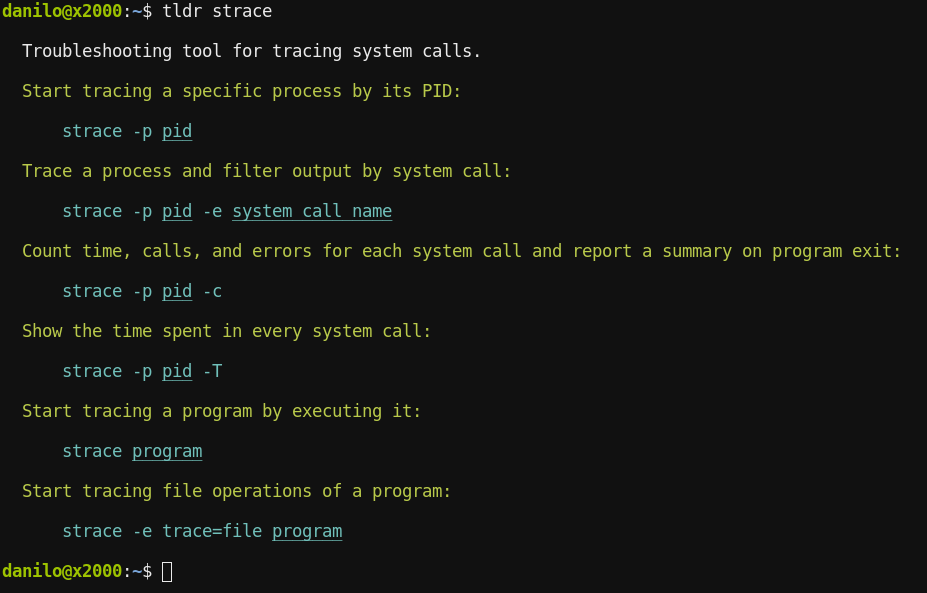

# tealdeer


|Crate|CI (Linux/macOS/Windows)|
|:---:|:---:|
|[![Crates.io][crates-io-badge]][crates-io]|[![GitHub CI][github-actions-badge]][github-actions]|

A very fast implementation of [tldr](https://github.com/tldr-pages/tldr) in
Rust: Simplified, example based and community-driven man pages.



If you pronounce "tldr" in English, it sounds somewhat like "tealdeer". Hence the project name :)

In case you're in a hurry and just want to quickly try tealdeer, you can find static
binaries on the [GitHub releases page](https://github.com/tealdeer-rs/tealdeer/releases/)!


## Docs (Installing, Usage, Configuration)

User documentation is available at <https://tealdeer-rs.github.io/tealdeer/>!

The docs are generated using [mdbook](https://rust-lang.github.io/mdBook/index.html).
They can be edited through the markdown files in the `docs/src/` directory.


## Goals

High level project goals:

- [x] Download and cache pages
- [x] Don't require a network connection for anything besides updating the cache
- [x] Command line interface similar or equivalent to the [NodeJS client][node-gh]
- [x] Comply with the [tldr client specification][client-spec]
- [x] Advanced highlighting and configuration
- [x] Be fast

A tool like `tldr` should be as frictionless as possible to use and show the
output as fast as possible.

We think that `tealdeer` reaches these goals. We put together a (more or less)
reproducible benchmark that compiles a handful of clients from source and
measures the execution times on a cold disk cache. The benchmarking is run in a
Docker container using sharkdp's [`hyperfine`][hyperfine-gh]
([Dockerfile][benchmark-dockerfile]).

| Client (50 runs, 17.10.2021)      | Programming Language | Mean in ms | Deviation in ms | Comments                |
| :---:                             | :---:                | :---:      | :---:           | :---:                   |
| [`outfieldr`][outfieldr-gh]       | Zig                  | 9.1        | 0.5             | no user configuration   |
| `tealdeer`                        | Rust                 | 13.2       | 0.5             |                         |
| [`fast-tldr`][fast-tldr-gh]       | Haskell              | 17.0       | 0.6             | no example highlighting |
| [`tldr-hs`][hs-gh]                | Haskell              | 25.1       | 0.5             | no example highlighting |
| [`tldr-bash`][bash-gh]            | Bash                 | 30.0       | 0.8             |                         |
| [`tldr-c`][c-gh]                  | C                    | 38.4       | 1.0             |                         |
| [`tldr-python-client`][python-gh] | Python               | 87.0       | 2.4             |                         |
| [`tldr-node-client`][node-gh]     | JavaScript / NodeJS  | 407.1      | 12.9            |                         |

As you can see, `tealdeer` is one of the fastest of the tested clients.
However, we strive for useful features and code quality over raw performance,
even if that means that we don't come out on top in this friendly competition.
That said, we are still optimizing the code, for example when the `outfieldr`
developers [suggested to switch][outfieldr-comment-tls] to a native TLS
implementation instead of the native libraries.

## Development

Creating a debug build with logging enabled:

    $ cargo build --features logging

Release build without logging:

    $ cargo build --release

To enable the log output, set the `RUST_LOG` env variable:

    $ export RUST_LOG=tldr=debug

To run tests:

    $ cargo test

To run lints:

    $ rustup component add clippy
    $ cargo clean && cargo clippy


## MSRV (Minimally Supported Rust Version)

When publishing a tealdeer release, the Rust version required to build it
should be stable for at least a month.


## License

Licensed under either of

 * Apache License, Version 2.0 ([LICENSE-APACHE](LICENSE-APACHE) or
   http://www.apache.org/licenses/LICENSE-2.0)
 * MIT license ([LICENSE-MIT](LICENSE-MIT) or
   http://opensource.org/licenses/MIT) at your option.


### Contribution

Unless you explicitly state otherwise, any contribution intentionally submitted
for inclusion in the work by you, as defined in the Apache-2.0 license, shall
be dual licensed as above, without any additional terms or conditions.

Thanks to @severen for coming up with the name "tealdeer"!

---

## 测试指南

### 开发环境测试

#### 后端 (Rust CLI) 测试

**运行路径**: `/mnt/data_nvme/code/tealdeer`

1. **单元测试**
```bash
# 运行所有测试
cargo test

# 运行测试并显示详细输出
cargo test -- --nocapture

# 跳过需要网络连接的测试（推荐用于CI/CD）
cargo test --features ignore-online-tests
```

**命令解释**:
- `cargo test`: 运行项目中所有的单元测试和集成测试
- `-- --nocapture`: 显示测试中的 println! 输出，便于调试
- `--features ignore-online-tests`: 启用特殊功能标志，跳过需要网络连接的测试

2. **集成测试**
```bash
# 运行集成测试
cargo test --test integration

# 测试特定功能模块
cargo test cache
cargo test config
cargo test output
```

**命令解释**:
- `--test integration`: 仅运行 tests/integration.rs 中的集成测试
- `cargo test cache`: 运行所有名称包含 "cache" 的测试函数

3. **代码质量检查**
```bash
# 安装 clippy（如果尚未安装）
rustup component add clippy

# 运行 linter 检查
cargo clean && cargo clippy

# 格式化代码
cargo fmt

# 检查格式是否正确（不修改文件）
cargo fmt --check
```

**命令解释**:
- `cargo clean`: 清理之前的构建缓存，确保 clippy 检查所有代码
- `cargo clippy`: Rust 官方 linter，检查代码质量和潜在问题
- `cargo fmt`: 使用 rustfmt 自动格式化代码
- `cargo fmt --check`: 检查代码格式是否符合标准，不修改文件

4. **功能测试**
```bash
# 构建调试版本（启用日志功能）
cargo build --features logging

# 设置日志级别并测试基本功能
export RUST_LOG=tldr=debug
./target/debug/tldr tar

# 测试更新缓存功能
./target/debug/tldr --update

# 测试列出所有可用页面
./target/debug/tldr --list

# 测试显示配置路径
./target/debug/tldr --show-paths

# 测试版本信息
./target/debug/tldr --version
```

**命令解释**:
- `--features logging`: 启用日志功能，允许调试输出
- `export RUST_LOG=tldr=debug`: 设置日志级别为 debug，显示详细调试信息
- `--update`: 从远程仓库更新 tldr 页面缓存
- `--list`: 列出所有可用的命令页面
- `--show-paths`: 显示配置文件和缓存目录的路径

#### 前端 (Tauri + Vue) 测试

**运行路径**: `/mnt/data_nvme/code/tealdeer/frontend/tealdeer-widget`

1. **前端依赖安装和测试**
```bash
# 安装 Node.js 依赖
npm install

# 启动开发服务器（仅 Web UI）
npm run dev

# 类型检查和构建测试
npm run build
```

**命令解释**:
- `npm install`: 根据 package.json 安装所有前端依赖
- `npm run dev`: 启动 Vite 开发服务器，用于前端开发调试
- `npm run build`: 构建前端资源并进行 TypeScript 类型检查

2. **Tauri 应用测试**
```bash
# 运行桌面应用（开发模式）
npm run tauri -- dev

# 后端 Rust 单元测试（需要启用测试功能）
cd src-tauri
cargo test --features test
```

**命令解释**:
- `npm run tauri -- dev`: 启动 Tauri 开发模式，同时运行前端和桌面应用
- `cargo test --features test`: 运行 Tauri 后端的 Rust 测试，启用测试功能标志

3. **构建测试**
```bash
# 构建生产版本（生成所有包格式）
npm run tauri -- build

# 仅构建 deb 和 rpm 包
npm run bundle:linux:deb-rpm

# 构建时禁用 strip（解决 linuxdeploy 问题）
npm run bundle:linux
```

**命令解释**:
- `npm run tauri -- build`: 构建完整的生产版本，生成 deb、rpm、AppImage 包
- `npm run bundle:linux:deb-rpm`: 仅生成 Linux 的 deb 和 rpm 包格式
- `npm run bundle:linux`: 使用 NO_STRIP=1 环境变量构建，避免某些系统的兼容性问题

### 生产环境测试

#### 系统集成测试

**运行路径**: `/mnt/data_nvme/code/tealdeer`

1. **发布版本构建测试**
```bash
# 构建优化的发布版本
cargo build --release

# 测试发布版本功能
./target/release/tldr --version
./target/release/tldr git
./target/release/tldr --update
```

**命令解释**:
- `cargo build --release`: 构建优化的生产版本，启用所有优化选项
- 测试基本功能确保发布版本正常工作

2. **跨平台兼容性测试**
```bash
# 测试不同平台页面
./target/release/tldr --platform linux df
./target/release/tldr --platform osx df
./target/release/tldr --platform windows dir
```

**命令解释**:
- `--platform`: 指定目标平台，测试跨平台页面兼容性

3. **性能基准测试**
```bash
# 如果安装了 hyperfine
hyperfine './target/release/tldr tar'

# 手动计时测试
time ./target/release/tldr tar
```

**命令解释**:
- `hyperfine`: 专业的基准测试工具，提供详细的性能统计
- `time`: 系统内置计时工具，显示执行时间

#### 安装包测试

**运行路径**: `/mnt/data_nvme/code/tealdeer/frontend/tealdeer-widget`

1. **打包测试**
```bash
# 生成所有支持的包格式
npm run tauri -- build

# 检查生成的包
ls -la src-tauri/target/release/bundle/
```

**命令解释**:
- 生成 deb (6.4M)、rpm (6.4M)、AppImage (97M) 三种包格式
- 检查包文件大小和完整性

2. **安装测试**
```bash
# 测试 deb 包安装（需要 root 权限）
sudo dpkg -i src-tauri/target/release/bundle/deb/*.deb

# 测试 AppImage 运行
chmod +x src-tauri/target/release/bundle/appimage/*.AppImage
./src-tauri/target/release/bundle/appimage/*.AppImage
```

**命令解释**:
- `dpkg -i`: Debian 包安装工具
- AppImage 是便携式应用格式，无需安装即可运行

---

## 生产环境编译和安装指南 (Arch Linux)

### 系统要求

- Arch Linux 系统
- Rust 1.85+ 工具链
- Node.js 20+ 和 npm
- 基本构建工具

### 编译前准备

#### 1. 安装依赖

```bash
# 更新系统包
sudo pacman -Syu

# 安装 Rust 工具链
sudo pacman -S rust

# 安装 Node.js 和 npm
sudo pacman -S nodejs npm

# 安装构建依赖
sudo pacman -S base-devel webkit2gtk-4.1 libayatana-appindicator

# 安装 Tauri 系统依赖
sudo pacman -S gtk3 webkit2gtk-4.1 libayatana-appindicator
```

#### 2. 清理旧资源

**运行路径**: `/mnt/data_nvme/code/tealdeer`

```bash
# 清理 Rust 构建缓存
cargo clean

# 清理前端构建缓存
cd frontend/tealdeer-widget
rm -rf node_modules
rm -rf src-tauri/target
rm -f package-lock.json
cd ../..
```

### 后端编译

**运行路径**: `/mnt/data_nvme/code/tealdeer`

#### 1. 构建 CLI 工具

```bash
# 构建发布版本
cargo build --release
```

**命令解释**:
- `cargo build`: Rust 的构建命令
- `--release`: 启用优化，生成生产环境版本
- 生成的二进制文件位于 `target/release/tldr`

#### 2. 运行测试确保质量

```bash
# 运行所有测试
cargo test --release

# 跳过网络测试（如果网络不稳定）
cargo test --release --features ignore-online-tests
```

### 前端编译

**运行路径**: `/mnt/data_nvme/code/tealdeer/frontend/tealdeer-widget`

#### 1. 安装依赖

```bash
# 安装 Node.js 依赖
npm install
```

**命令解释**:
- `npm install`: 根据 package.json 安装所有依赖
- 依赖包括 Vue 3、Tauri API、TypeScript 等

#### 2. 构建桌面应用

```bash
# 构建生产版本（生成所有包格式）
npm run tauri -- build
```

**命令解释**:
- `npm run tauri -- build`: 执行 Tauri 构建命令
- 会同时构建前端 Vue 应用和后端 Rust 代码
- 生成 deb、rpm、AppImage 等多种包格式

#### 3. 仅构建特定格式（可选）

```bash
# 仅构建 deb 和 rpm 包
npm run bundle:linux:deb-rpm

# 构建时禁用 strip（解决某些系统的兼容性问题）
npm run bundle:linux
```

### 安装应用

#### 方法 1: 安装 CLI 工具

**运行路径**: `/mnt/data_nvme/code/tealdeer`

```bash
# 复制到系统路径
sudo cp target/release/tldr /usr/local/bin/

# 设置执行权限
sudo chmod +x /usr/local/bin/tldr

# 安装 shell 补全（可选）
sudo cp completion/tldr.bash /usr/share/bash-completion/completions/tldr
sudo cp completion/tldr.fish /usr/share/fish/vendor_completions.d/tldr.fish
sudo cp completion/_tldr /usr/share/zsh/site-functions/_tldr
```

#### 方法 2: 安装桌面应用

**运行路径**: `/mnt/data_nvme/code/tealdeer/frontend/tealdeer-widget`

##### 使用 deb 包安装

```bash
# 查找生成的 deb 包
ls src-tauri/target/release/bundle/deb/

# 安装 deb 包（需要 root 权限）
sudo pacman -U src-tauri/target/release/bundle/deb/*.deb
```

**注意**: Arch Linux 原生不支持 deb 包，需要使用 `debtap` 工具转换：

```bash
# 安装 debtap（从 AUR）
yay -S debtap

# 更新 debtap 数据库
sudo debtap -u

# 转换 deb 包为 Arch 包
debtap src-tauri/target/release/bundle/deb/*.deb

# 安装转换后的包
sudo pacman -U *.pkg.tar.xz
```

##### 使用 AppImage

```bash
# 查找生成的 AppImage
ls src-tauri/target/release/bundle/appimage/

# 设置执行权限
chmod +x src-tauri/target/release/bundle/appimage/*.AppImage

# 复制到应用目录
sudo cp src-tauri/target/release/bundle/appimage/*.AppImage /opt/tealdeer-widget

# 创建桌面快捷方式
sudo tee /usr/share/applications/tealdeer-widget.desktop > /dev/null << EOF
[Desktop Entry]
Name=Tealdeer Widget
Comment=GUI client for tldr pages
Exec=/opt/tealdeer-widget
Icon=tealdeer
Type=Application
Categories=Utility;
EOF
```

### 权限设置

```bash
# 确保 CLI 工具有执行权限
sudo chmod +x /usr/local/bin/tldr

# 确保桌面应用有执行权限
sudo chmod +x /opt/tealdeer-widget

# 设置配置目录权限（如果需要）
mkdir -p ~/.config/tealdeer
chmod 755 ~/.config/tealdeer
```

### 运行应用

#### CLI 工具

```bash
# 首次运行，更新缓存
tldr --update

# 查看命令帮助
tldr git

# 列出所有可用页面
tldr --list

# 查看配置路径
tldr --show-paths
```

#### 桌面应用

```bash
# 直接运行 AppImage
/opt/tealdeer-widget

# 或者从应用菜单启动
# 在桌面环境中搜索 "Tealdeer Widget"
```

### 验证安装

```bash
# 验证 CLI 工具
tldr --version
tldr tar

# 验证桌面应用（如果安装了）
/opt/tealdeer-widget --version 2>/dev/null || echo "Desktop app installed successfully"
```

### 卸载

#### 卸载 CLI 工具

```bash
sudo rm /usr/local/bin/tldr
sudo rm /usr/share/bash-completion/completions/tldr
sudo rm /usr/share/fish/vendor_completions.d/tldr.fish
sudo rm /usr/share/zsh/site-functions/_tldr
```

#### 卸载桌面应用

```bash
# 如果使用包管理器安装
sudo pacman -R tealdeer-widget

# 如果手动安装 AppImage
sudo rm /opt/tealdeer-widget
sudo rm /usr/share/applications/tealdeer-widget.desktop

# 清理用户配置
rm -rf ~/.config/tealdeer
rm -rf ~/.cache/tealdeer
```

---

[node-gh]: https://github.com/tldr-pages/tldr-node-client
[c-gh]: https://github.com/tldr-pages/tldr-c-client
[hs-gh]: https://github.com/psibi/tldr-hs
[fast-tldr-gh]: https://github.com/gutjuri/fast-tldr
[bash-gh]: https://4e4.win/tldr
[outfieldr-gh]: https://gitlab.com/ve-nt/outfieldr
[python-gh]: https://github.com/tldr-pages/tldr-python-client

[benchmark-dockerfile]: https://github.com/tealdeer-rs/tealdeer/blob/main/benchmarks/Dockerfile
[client-spec]: https://github.com/tldr-pages/tldr/blob/main/CLIENT-SPECIFICATION.md
[hyperfine-gh]: https://github.com/sharkdp/hyperfine
[outfieldr-comment-tls]: https://github.com/tealdeer-rs/tealdeer/issues/129#issuecomment-833596765

<!-- Badges -->
[github-actions]: https://github.com/tealdeer-rs/tealdeer/actions?query=branch%3Amain
[github-actions-badge]: https://github.com/tealdeer-rs/tealdeer/actions/workflows/ci.yml/badge.svg?branch=main
[crates-io]: https://crates.io/crates/tealdeer
[crates-io-badge]: https://img.shields.io/crates/v/tealdeer.svg


请你分别给出在生产环境和开发环境下需要做的所有测试的具体执行步骤。具体执行步骤包括了命令，详细的命令解释，该命令运行的路径。

请你给出如何在生产环境下编译前后端，并在archlinux系统上安装该APP的详细步骤，该步骤需要包括，编译前准备(清理旧资源)，运行编译命令的路径，具体编译命令，详细的编译命令解释，权限设置，安装APP的命令，如何运行APP等。

所有上述内容，请你以中文的形式加入到README.md文档中。